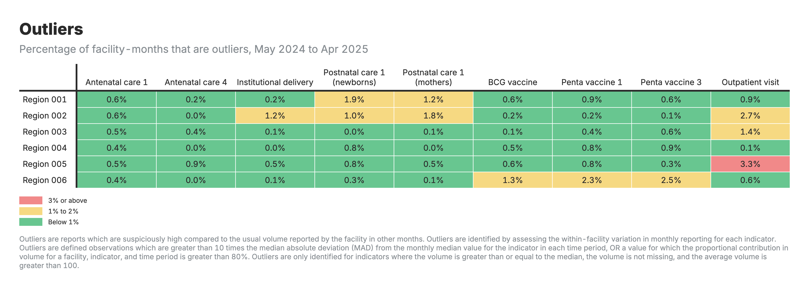
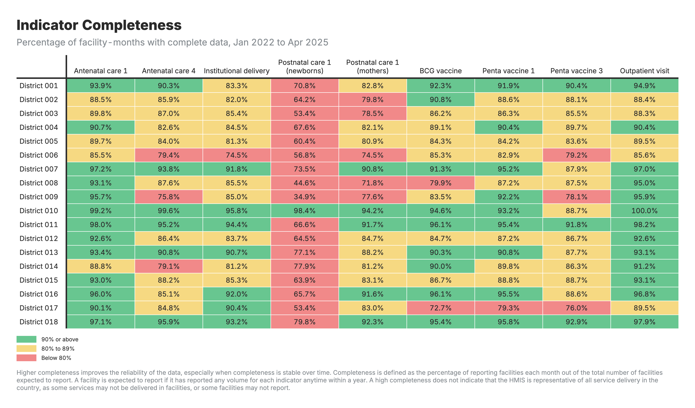
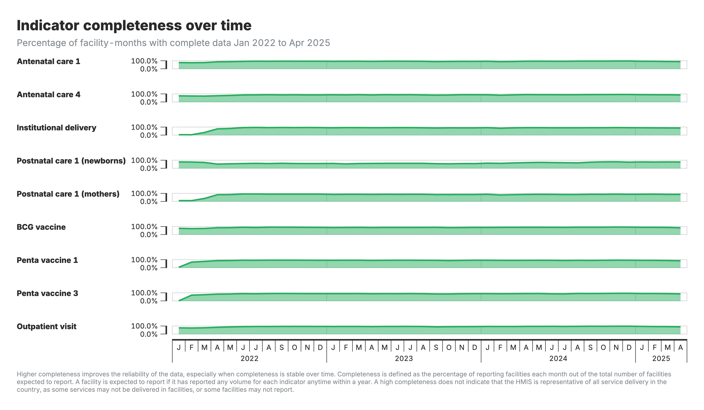
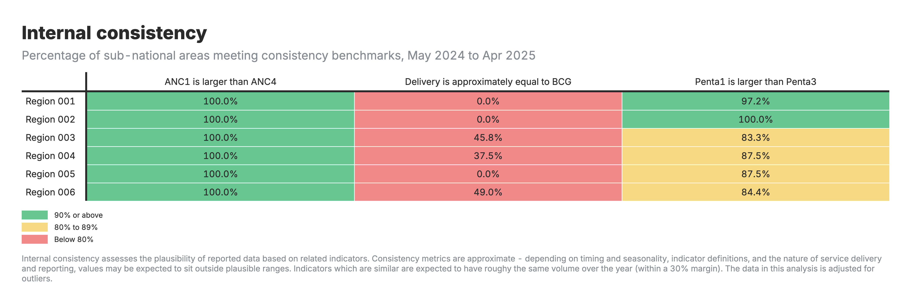
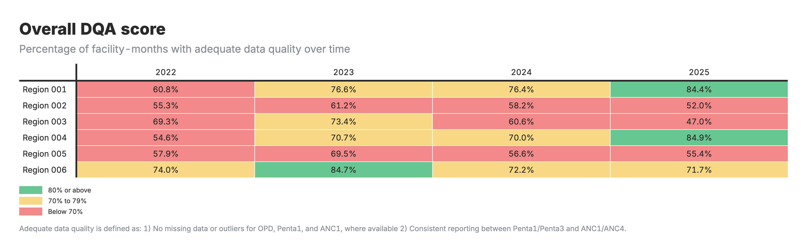
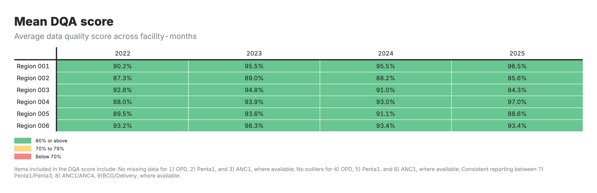

# Module 1: Data Quality Assessment (DQA)

## Background

Routinely reported health facility data are an important source for health indicators at the facility and population levels. Health facilities report on events such as immunizations given or live births attended by a skilled provider. As with any data, quality is an issue. Data need to be checked to consider completeness of reporting by health facilities, identify extreme outliers, and evaluate internal consistency. A standard approach for assessing data quality allows for assessment of progress over time. The FASTR approach conducts an analysis of monthly data by facility and by indicator to assess data quality. Results are presented as annual estimates but may comprise a partial year of data given the availability of data at the time the analysis is conducted (e.g., an analysis conducted in June 2024 may contain data from January – May 2024, and this will be presented as the analysis for 2024).

## Overview

The Data Quality Assessment (DQA) module is designed to evaluate the reliability of HMIS (Health Management Information System) data by examining three key components:

1.  **Detecting Outliers**: Identifies extreme observations that may indicate reporting errors or anomalies.

2.  **Assessing Completeness**: Evaluates whether health facilities are consistently reporting data over time.

3.  **Measuring Consistency** – Checks whether related indicators align with expected patterns.

Finally, these assessments are integrated to generate a DQA score, which reflects the overall data quality. The following sections will provide a detailed explanation of each component, outlining the methodology and parameters applied in the analysis.

### Outlier Detection

In FASTR, outliers are defined as unusually high values based on two criteria:

-   A value greater than 10 times the Median Absolute Deviation (MAD) from the median (computed only on values ≥ median), or

-   A value contributing over 80% of the total volume for that indicator and facility-year.

These criteria are applied only to volumes above 100 and exclude missing values. The MAD threshold (`MADS`) and proportion threshold (`OUTLIER_PROPORTION_THRESHOLD`) can be adjusted in the interface.

#### Detailed analysis steps

This analysis is designed to detect and correct outliers in service volume data reported by health facilities. The code applies multiple methods to identify outliers, including the calculation of the Median Absolute Deviation (MAD) and the proportion of total service volume reported in a given time period. The process consists of four key steps:

**Step 1: Calculation of Median volume**

-   For each health facility and service indicator, the median service volume is computed using all available data points.

**Step 2: Compute MAD using values equal to or above the median**

-   The MAD is calculated for each facility-indicator combination, considering only values equal to or above the median.
-   The residual between the observed count and the median is divided by the MAD to generate a standardized residual.
-   An observation is flagged as an outlier if its MAD residual exceeds a predefined threshold (`MADS`). The MADS parameter, which determines the number of MADs required for an observation to be classified as an outlier, can be adjusted through the user interface (UI).

**Step 3: Calculation of proportional contribution and outlier flagging**

-   The proportional contribution of each facility’s reported count to the total count for a given indicator and year is computed.
-   Any observation exceeding a predefined proportion threshold (`OUTLIER_PROPORTION_THRESHOLD`, default: 0.8) is flagged as a potential outlier. This threshold can be modified through the UI to fine-tune outlier detection sensitivity.

**Step 4: Combining outlier flags and preparing data output**

-   The final outlier flag is determined by combining MAD-based and proportional contribution-based outlier flags.
-   An observation is classified as an outlier if it is flagged by either method and its count exceeds a specified threshold (`MINIMUM_COUNT_THRESHOLD`, default: 100). The `MINIMUM_COUNT_THRESHOLD` ensures that only facilities with a sufficiently large volume are considered for outlier detection, avoiding excessive flagging of small counts. This parameter is also adjustable in the UI.
-   The final dataset is prepared with relevant columns, including facility identifiers, geographic details, indicator IDs, time variables, and outlier-related metrics.

### Statistical notes

#### How is a Median Absolute Deviation (MAD) calculated ?

-   Compute the median: find the median of the dataset.
-   Calculate absolute deviations: subtract the median from each data point to get the absolute deviations (i.e., take the absolute value of the difference between each data point and the median).
-   Find the median of absolute deviations: calculate the median of these absolute deviations.
-   To determine the degree of outlier, calculate the median average absolute deviation residuals: $$ \frac{\text{abs(volume - median volume)}}{\text{MAD}} $$
-   If this value is greater than 10, the value is an outlier.

### Consistency between related indicators

Program indicators with a predictable relationship are examined to determine whether the expected relationship exists between them. In other words, this process examines whether the observed relationship between the indicators, as shown in the reported data, is that which is expected.

#### FASTR definition of internal consistency

FASTR assesses the following pairs of indicators to measure internal consistency:

| Indicator Pair            | Expected Relationship     |
|---------------------------|---------------------------|
| ANC1 / ANC 4              | Ratio ≥ 0.95              |
| Penta1 / Penta 3          | Ratio ≥ 0.95              |
| BCG / Facility Deliveries | Ratio between 0.7 and 1.3 |

These pairs of indicators have expected relationships. For example, we expect the number of pregnant women receiving a first ANC visit will always be higher than the number of pregnant women receiving a fourth ANC visit. BCG is a birth dose vaccine so we expect that these indicators will be equal. However, we recognize there may be more variability in this predicted relationship thus we set a range of within 30%.

#### Detailed analysis steps

This analysis identifies inconsistencies in service volume data by comparing related indicators at the lowest possible geographic aggregation level (e.g., district, ward). Since individuals may seek different services at multiple facilities within their local area, assessing consistency at this level provides a more accurate picture of service utilization patterns across a community. Instead of attributing all services to a single facility, this approach accounts for movement between facilities within a district or ward. Consistency benchmarks are then applied to detect potential discrepancies in the reporting of related indicators. The process consists of the following main steps:

**Step 1: Determine the geographic level**

-   The lowest available geographic level is selected dynamically based on data availability, ensuring the most disaggregated level is used.

**Step 2: Exclude outliers**

-   Data points flagged as outliers (`outlier_flag = 1`) are removed to prevent extreme values from skewing the consistency assessment.

**Step 3: Aggregate data at the selected geographic level and reshape to wide**

-   Service volume data is aggregated at the lowest geographic level for each indicator (summing values across facilities for each combination of geographic area, indicator, year, and month).

-   The aggregated data is then reshaped into a wide format, where each indicator is represented as a separate column.

**Step 4: Calculate consistency ratios**

-   Predefined pairs of related indicators are extracted from the consistency parameters.

-   For each indicator pair, the ratio of the first indicator to the second indicator is calculated.

-   If the denominator is zero, the consistency ratio is set to NA.

**Step 5: Apply consistency benchmarks** - Each indicator pair has predefined lower and upper bounds for acceptable consistency ratios.

$$
\text{ANC Consistency} =
\begin{cases} 1, & \frac{\text{ANC1 Volume}}{\text{ANC 4 Volume}} \geq 0.95 \\ 0, & \text{otherwise}
\end{cases}
$$

$$
\text{Penta Consistency} =
\begin{cases}
1, & \frac{\text{Penta 1 Volume}}{\text{Penta 3 Volume}} \geq 0.95 \\
0, & \text{otherwise}
\end{cases}
$$

$$
\text{BCG/Delivery Consistency} =
\begin{cases}
1, & 0.7 \leq \frac{\text{BCG Volume}}{\text{Delivery Volume}} \leq 1.3 \\
0, & \text{otherwise}
\end{cases}
$$

-   If the computed ratio falls within this range, the pair is marked as consistent (`sconsistency = 1`).
-   If the ratio is outside the bounds, the pair is flagged as inconsistent (`sconsistency = 0`).
-   If the ratio cannot be computed due to missing values, it remains NA.

**Step 6: Expand results to facility level**

-   Each facility is assigned the consistency results of its corresponding district or ward.

### Indicator completeness

Indicator completeness measures the extent to which facilities that are supposed to report data on the selected core indicators are in fact doing so. Higher completeness improves reliability of the data, especially when completeness is stable over time. This is different from overall reporting completeness in that it looks at completeness of specific data elements and not only at the receipt of the monthly reporting form.

#### FASTR definition of indicator completeness

For the FASTR analysis, completeness is defined as the percentage of reporting facilities each month out of the total number of facilities expected to report.

For a given indicator in a given month, $$ \text{Completeness} = \frac{\text{Number of reporting facilities}}{\text{Number of expected facilities}} \times 100 $$

A facility is expected to report for an indicator if it has ever reported for that indicator within the year. A facility is flagged as inactive if it did not report for six or more consecutive months before its first or after its last report.

*Notes on completeness*: A high level of completeness does not necessarily indicate that the HMIS is representative of all service delivery in the country as some services many not be delivered in facilities, or some facilities may not report. For countries where the DHIS2 system does not store zeroes, indicator completeness may be underestimated if there are many low-volume facilities for a given indicator.

Completeness is estimated for the following indicators in the core FASTR analysis:

-   Outpatient visits

-   Outpatient department visits (OPD)

-   First antenatal care visit (ANC1)

-   Fourth antenatal care visit (ANC 4)

-   Institutional delivery

-   Postnatal care visit 1 (PNC1)

-   BCG vaccine (BCG)

-   First pentavalent vaccine (Penta 1)

-   Third pentavalent vaccine (Penta 3)

Country specific adaptations may include additional indicators of interest to the country.

#### Detailed analysis steps

This analysis ensures that all health facilities and indicators have a complete and continuous time series for service volume data. The process includes detecting missing data, generating full time series records, and tagging completeness based on reporting patterns. The methodology follows these key steps:

**Step 1: Generate full time series per indicator**

-   For each indicator, the reporting time range (first and last reported month) is identified.
-   A complete month-wise facility-indicator grid is generated, ensuring that every facility has a full sequence of months between its first and last reporting period.
-   Period and quarter identifiers (`period_id` and `quarter_id`) are created in `YYYYMM` format to facilitate tracking.

**Step 2: Merge with existing data** - The generated full time series is merged with the actual reported data to retain observed counts. - Missing values in the count column indicate periods where a facility did not report service volumes.

**Step 3: Apply completeness tagging**

-   Each facility's reporting behavior is assessed using the following flags:
    -   `has_reported`:Indicates whether a facility has reported for a given month.
    -   `first_report_idx:` Identifies the first month a facility submitted a report.
    -   `last_report_idx`: Identifies the last month a facility submitted a report.
    -   `missing_group`: Assigns a unique identifier to each consecutive period of missing months for a facility. When a facility has missing data for multiple months in a row, they are grouped under the same `missing_group_id`. If reporting resumes and then stops again, a new `missing_group_id` is assigned to the next block of missing months. This helps distinguish separate reporting gaps within a facility’s data.
    -   `missing_count`: Represents the number of consecutive missing months within each `missing_group`.
-   A facility is flagged as **inactive** (`offline_flag = 2)` if:
    -   It remained inactive (did not report any data) for six or more consecutive months before its first reported month.
    -   It remained inactive for six or more consecutive months after its last reported month.

**Step 4: Assign completeness tags**

-   Each facility’s completeness status is classified as follows:
    -   Complete (`1`): Facility reported data for that period.
    -   Incomplete (`0`): Facility did not report but was not considered inactive.
    -   Inactive (`2`): Facility was flagged as inactive based on reporting gaps.

**Step 5: Final data preparation**

-   Rows where a facility is flagged as inactive (`completeness_flag = 2`) are removed to maintain focus on active facilities.
-   The final dataset includes completeness flags alongside facility, indicator, time, and geographic details.

### Data Quality Assessment (DQA)

A composite measure of data quality provides an overall view of how well a dataset meets quality standards. By integrating multiple dimensions of data quality into a single score, it simplifies the interpretation of detailed information from several measures. This allows health systems to quickly assess the reliability of data, making it easier to identify trends and issues at a glance.

#### FASTR definition of overall data quality score

For the FASTR analysis, a facility is considered to have adequate data quality only if all the following conditions are met for the selected DQA indicators (e.g., Penta 1, ANC1, and family planning indicators, where available):

1.  **No missing data** for these indicators (i.e., the facility must report every month it is expected to).

2.  **No outliers** detected for these indicators.

3.  **Internal consistency** is achieved between related pairs (e.g., ANC1/ANC4 and Penta1/Penta3).

Only the indicators specified in the configuration (parameter `DQA_INDICATORS`) are subject to these strict rules.

#### Detailed analysis steps

This analysis evaluates data quality by incorporating completeness, outlier detection, and consistency checks. The process generates a DQA score at the facility-month level, ensuring that health service data meets predefined quality standards. The steps for each are detailed below.

**Step 1: Filter relevant indicators**

-   The indicators used for DQA are defined in the user interface and stored in `DQA_INDICATORS`. A predefined set may include Penta 1, ANC1 and OPD.
-   Only indicators specified in `DQA_INDICATORS` are selected from completeness and outlier datasets and evaluated in the DQA.

**Step 2: Merge completeness and outlier data**

-   Completeness and outlier data are merged at the facility-month-indicator level.
-   Missing values (NA) imputed from the completeness analysis are treated as non-outliers.
-   Completeness and outlier pass flags are assigned:
    -   `completeness_pass` = 1 if the completeness status matches the required DQA rule.
    -   `outlier_pass` = 1 if the outlier status matches the required DQA rule.

**Step 3: Aggregate scores at the facility-month level**

-   The total indicator points are calculated as the sum of completeness and outlier pass scores.
-   The maximum possible score is determined based on the number of indicators.
-   A normalized completeness and outlier score `completeness_outlier_score` is also calculated: $$ \text{CompletenessAndOutlier Score} = \frac{\text{Total Indicator Points}}{\text{Maximum Possible Points}} $$

Example: Suppose a facility is assessed for three indicators. Each indicator can score up to 2 points (outlier and completeness), making the maximum possible score = 6. If the facility scores 5 points, the completeness-outlier score is: $$ \text{CompletenessAndOutlier Score} = \frac{5}{6} = 0.83 $$

A binary DQA completeness-outlier pass flag is assigned (1 if the facility passes all checks, otherwise 0).

**Step 4: Merge with consistency data**

-   The consistency dataset is merged at the facility-month level.
-   Any missing consistency values are filled with 0.
-   Two consistency ratios are used in the DQA: ANC1/ANC4 and Penta1/Penta3.
-   The total number of consistency checks passed is calculated.
-   A normalized consistency score is computed as the proportion of indicator pairs that meet the defined consistency threshold.
-   A binary consistency pass flag (`all_pairs_pass = 1`) is assigned when *all* applicable indicator pairs are consistent.

**Step 5: Compute final DQA score**

The final DQA score is a binary measure that combines completeness, outlier, and consistency results:

A facility-month receives a DQA score of 1 (pass) only if:

-   All completeness and outlier checks are passed, *and*

-   All applicable consistency checks are passed

Otherwise, the DQA score is 0 (fail).

**Handling cases with missing consistency data**

If no indicators required for consistency checks are available in the dataset, the DQA analysis is performed only on completeness and outlier checks.

The DQA score in such cases is determined solely based on completeness and outlier pass criteria.

#### Analysis outputs, data visualization and interpretation

The FASTR analysis generates six main visual outputs:

1.  Outliers: Heatmap table with zones as rows and health indicators as columns, color-coded by outlier percentage.

    

2.  Indicator Completeness: Heatmap table with zones as rows and health indicators as columns, color-coded by completeness percentage.

    

3.  Indicator completeness over time: Horizontal timeline charts showing completeness trends for each indicator over the analysis period.

    

4.  Internal consistency: Heatmap table with zones as rows and consistency benchmark categories as columns, color-coded by performance.

    

5.  Overall DQA score: Heatmap table with zones as rows and time periods as columns, color-coded by DQA score percentage.

    

6.  Mean DQA score: Heatmap table with zones as rows and time periods as columns, color-coded by average DQA score.

    

Color Coding:

-   Green: 90% or above (completeness/consistency), Below 1% (outliers)

-   Yellow: 80% to 89% (completeness), 1% to 2% (outliers)

-   Red: Below 80% (completeness/consistency), 3% or above (outliers)

------------------------------------------------------------------------

Last edit 2025 September 3 (test1)
